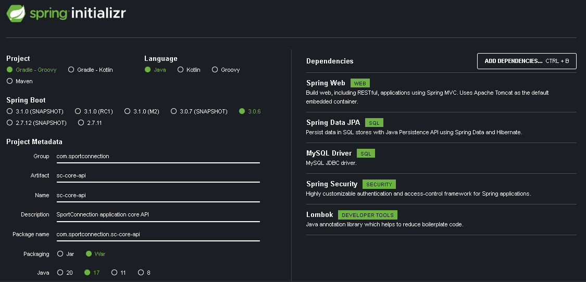
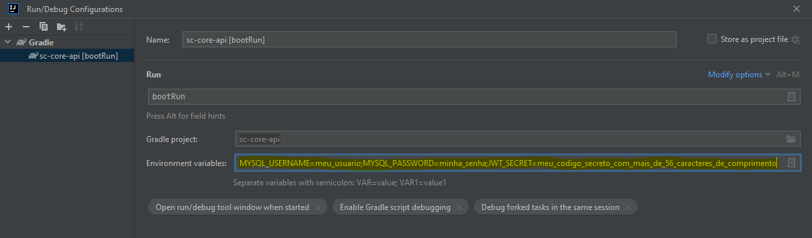

# SPORT CONNECTION - CORE API

---

# GRUPO

- RM346315: Lais Kagawa ([lakagawa](https://github.com/lakagawa))
- RM346511: Jônatha Lacerda Gonzaga ([jhowlacerda](https://github.com/jhowlacerda))
- RM346958: Thiago de Souza Zanella ([zanella86](https://github.com/zanella86))

---

# REPOSITÓRIOS RELACIONADOS

https://github.com/zanella86/SportConnection

---

# FERRAMENTAS / TECNOLOGIAS

- Git / Github
- Gradle 7.6.1
- IntelliJ IDEA Community Edition (2022.2.1)
- Spring Framework (Java 17+)
- Swagger

---

# CONSTRUÇÃO/JUSTIFICATIVA

<u>Utilizamos o Spring Framework:</u>

- **Spring Boot:** Para produtividade na configuração do ambiente e desenvovimento.
- **Spring Web:** Para disponibilização dos _endpoints_ (Tomcat embutido).
- **Spring Data JPA:** Persistência via _Hibernate_.
- **Spring Security:** Para gerenciamento de acessos (_Basic Authentication_).
  - **OAuth2 Client:** Para integração do _Spring Boot_ aos recursos do _OpenID_ do _Spring Security_.

<u>Outros:</u>

- MySQL Driver: Para utilização do MySQL.
- Lombok: Para redução da verbosidade.

---

# PARA TESTAR

## Bancos de dados

### MySQL

- Crie um *database schema* no MySQL chamado `sport-connection`

## Aplicação

### IDE

Adicione os parâmetros para conexão:

> MYSQL_USERNAME=meu_usuario;MYSQL_PASSWORD=minha_senha

### Swagger

Documentação disponível em: http://localhost:8080/sc-core/swagger-ui/index.html#/

---

# REFERÊNCIAS

- [Spring Initializr](https://start.spring.io/;)
