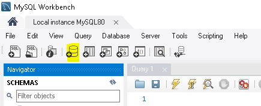

# SPORT CONNECTION - CORE API

---

# GRUPO

- RM346315: Lais Kagawa ([lakagawa](https://github.com/lakagawa))
- RM346511: Jônatha Lacerda Gonzaga ([jhowlacerda](https://github.com/jhowlacerda))
- RM346958: Thiago de Souza Zanella ([zanella86](https://github.com/zanella86))

---

# REPOSITÓRIOS RELACIONADOS

https://github.com/zanella86/SportConnection

---

# FERRAMENTAS / TECNOLOGIAS

- Git / Github
- Gradle 7.6.1
- IntelliJ IDEA Community Edition (2022.2.1)
- MySQL Workbench 8.0 CE
- Spring Framework (Java 17+)
- Swagger

---

# CONSTRUÇÃO/JUSTIFICATIVA

<u>Utilizamos o Spring Framework:</u>

- **Spring Boot:** Para produtividade na configuração do ambiente e desenvovimento.
- **Spring Web:** Para disponibilização dos _endpoints_ (Tomcat embutido).
- **Spring Data JPA:** Persistência via _Hibernate_.
- **Spring Security:** Para gerenciamento de acessos (_Basic Authentication_).
  - **JWT:** Para autenticação com _Token_ (_Header Authorization_).
  <!-- - **OAuth2 Client:** Para integração do _Spring Boot_ aos recursos do _OpenID_ do _Spring Security_. -->

<u>Outros:</u>

- MySQL Driver: Para utilização do MySQL.
- Lombok: Para redução da verbosidade.

---

# PARA TESTAR

## Bancos de dados

### MySQL

- Crie um *database schema* no MySQL chamado `sport-connection`

## Aplicação

### IDE

Adicione as variáveis de ambiente e ajuste os valores conforme as configurações do seu ambiente:

> MYSQL_USERNAME=meu_usuario;MYSQL_PASSWORD=minha_senha;JWT_SECRET=meu_codigo_secreto_com_mais_de_56_caracteres_de_comprimento

### Swagger

Documentação disponível em: http://localhost:8080/sc-core/swagger-ui/index.html#/

#### Como fazer para usar?

1. Os _requests_ referente a `profile-controller` e `events-controller` necessitam de autorização no _header_.
2. O botão `Authorize` deve ser utilizado para definir o _token_ que será utilizado em todas as requisições que necessitam de autorização (parâmetro **Authorization** no _header_).

#### Como autorizar?

1. Clique em `Try it out` para habilitar edição dos campos

1. Preencha os campos com os dados (DETALHE: Se não tiver login cadastrado, realize uma chamada no request users/register)
2. Clique no botão Execute
3. Status Code do retorno da chamada
4. O Response body da chamada. Copiar o conteúdo da propriedade `token`

1. Clicar no botão `Authorize` para abrir o popup da imagem anterior
2. Colar o valor do token (copiado do passo anterior)
3. Clicar em `Authorize`

Pronto Authorization configurada, agora é só testar os outros requests.

---

# REFERÊNCIAS

- [Spring Initializr](https://start.spring.io/)
- [Profº Fabio Tadashi](https://github.com/fabiotadashi/1SCJR-travel/tree/main/web)
- [Profº Eduardo Galego](https://github.com/prof-eduardo-galego/fiap-spring-rest)
- [Profº Rafael Matsuyama](https://github.com/rafaelmatsuyama/FIAP-2022-SCJ-JavaPersistence)
<!-- - [OAuth 2.0 Login](https://docs.spring.io/spring-security/reference/servlet/oauth2/login/index.html) -->
